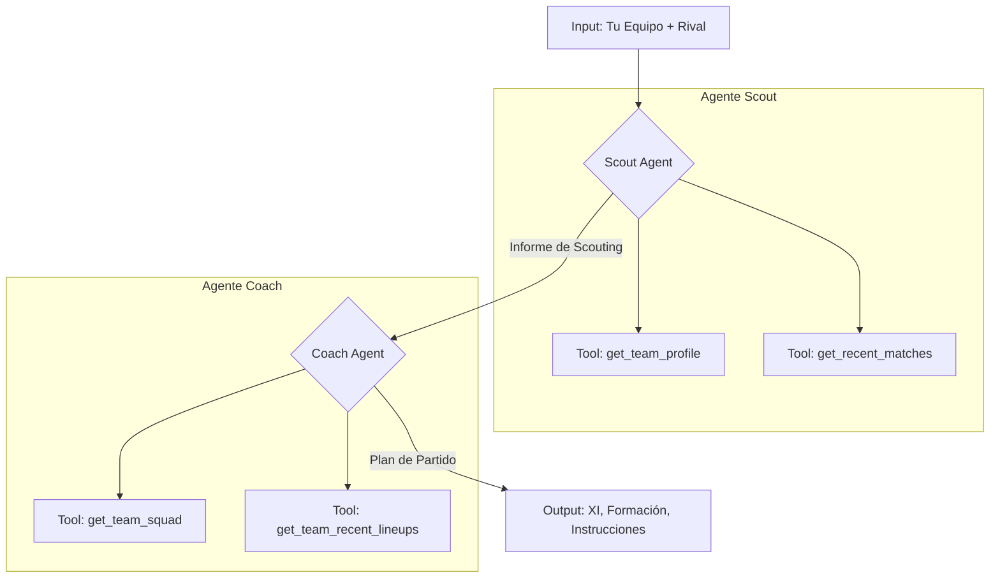

# Informe del Proyecto: Coach IA

## Resumen General

**Coach IA** es un sistema de inteligencia artificial multi-agente diseñado para actuar como asistente táctico en el fútbol. El sistema toma como entrada un equipo y un rival de la temporada 2025-26 de La Liga y genera un análisis táctico completo que incluye:

1.  Un informe de **scouting** del equipo rival.
2.  Una **alineación titular** (XI) con una formación específica.
3.  Tres **instrucciones tácticas** para el partido.

El proyecto se distingue por utilizar datos reales de la temporada para fundamentar sus recomendaciones, en lugar de depender únicamente del conocimiento interno del modelo de lenguaje.

## Arquitectura del Sistema

El núcleo del proyecto es un grafo de `LangGraph` que orquesta la colaboración entre dos agentes especializados: un **Scout** y un **Coach**.

### 1. Agente Scout

-   **Función:** Analizar al equipo rival.
-   **Proceso:** Utiliza herramientas (`tools`) para consultar datos procesados (en formato CSV) sobre el perfil del equipo y sus partidos recientes.
-   **Salida:** Genera un informe de scouting estructurado que describe el estilo de juego, las fortalezas, las debililades y el estado de forma del rival.
-   **Implementación:** `src/agents/scout/agent.py` y `src/agents/scout/tools.py`.

### 2. Agente Coach

-   **Función:** Diseñar el plan de partido para su propio equipo.
-   **Proceso:** Recibe el informe del Scout como punto de partida. Luego, utiliza sus propias herramientas para consultar la plantilla actual del equipo y las alineaciones utilizadas en partidos recientes.
-   **Salida:** Propone una alineación titular, una formación táctica y tres instrucciones específicas para el partido.
-   **Implementación:** `src/agents/coach/agent.py` y `src/agents/coach/tools.py`.

### Orquestador

-   **Función:** Coordinar el flujo de trabajo entre los agentes.
-   **Tecnología:** `LangGraph`.
-   **Proceso:** Define un grafo de estados (`StateGraph`) que primero ejecuta el nodo `scout` y luego, con la salida de este, ejecuta el nodo `coach`.
-   **Implementación:** `src/graph.py`.

## Flujo de Datos

El sistema no interactúa con APIs externas en tiempo real, sino que se basa en un conjunto de datos pre-procesados y almacenados localmente.

1.  **Descarga de Datos:**
    -   `src/data/fetch.py`: Utiliza la librería `soccerdata` para descargar estadísticas de equipos y jugadores de *Understat* para la temporada 2025-26 de La Liga.
    -   `src/data/fetch_lineups.py`: Descarga las alineaciones de los partidos desde *ESPN*.
2.  **Datos Procesados:**
    -   Los datos se guardan en la carpeta `data/processed/` en formato CSV. Los archivos principales son:
        -   `teams.csv`: Estadísticas agregadas por equipo.
        -   `players.csv`: Estadísticas por jugador.
        -   `matches.csv`: Información de cada partido.
        -   `lineups.csv`: Alineaciones de cada partido.

## Análisis y Visualización de Resultados (Notebooks)

Los notebooks de Jupyter son componentes cruciales para la validación de los datos y el análisis de los resultados del sistema.

### `notebooks/01_eda.ipynb`: Análisis Exploratorio de Datos

Este notebook es el primer paso para entender y validar los datos que alimentarán a los agentes. Su propósito es doble:

1.  **Verificación de la Calidad de los Datos:**
    -   Se carga el conjunto de datos (`players.csv`, `teams.csv`, etc.) y se realizan comprobaciones básicas de integridad, como la búsqueda de valores nulos (NaN) y registros duplicados. Esto asegura que los agentes trabajarán con información limpia y fiable.
    -   Se analiza el rango de fechas de los partidos para confirmar que se tiene la temporada completa.

2.  **Definición de Umbrales Tácticos:**
    -   El notebook explora métricas clave como el **PPDA** (Pases por Acción Defensiva) y las **Deep Completions** (pases completados en el último tercio del campo).
    -   Calcula los cuartiles (25%, 50%, 75%) para estas métricas en toda la liga.
    -   Estos cuartiles se utilizan para establecer umbrales objetivos que permiten al **Agente Scout** clasificar el estilo de un equipo. Por ejemplo, si el PPDA de un equipo está por debajo del primer cuartil, se etiqueta como de "presión alta".
    -   Esta calibración es fundamental para que las descripciones del Scout no sean subjetivas, sino que estén basadas en la distribución real de los datos de la temporada.

### `notebooks/02_eval_results.ipynb`: Análisis de la Evaluación

Este notebook es la herramienta central para interpretar el rendimiento del sistema. Una vez que `src/evals/run.py` ha ejecutado el sistema contra la muestra de 30 partidos y ha guardado los resultados, este notebook los carga y los analiza en profundidad.

1.  **Carga de Resultados:**
    -   Localiza y carga el archivo CSV más reciente generado por la suite de evaluación.

2.  **Análisis Agregado y por Segmentos:**
    -   Calcula las estadísticas descriptivas (media, desviación estándar, etc.) para las métricas clave (`lineup_overlap`, `formation_match`, `tactical_coherence`, etc.) sobre el total de los 30 partidos.
    -   Realiza un análisis segmentado (`groupby`) por `tier` (top, mid, bottom) para investigar si el rendimiento del sistema varía según la calidad del equipo.

3.  **Identificación de Casos de Estudio:**
    -   Identifica los mejores y peores partidos para cada métrica. Por ejemplo, muestra los 3 partidos con el `lineup_overlap` más alto y los 3 con el más bajo.
    -   Para las métricas cualitativas como `faithfulness`, muestra la justificación (el `rationale`) proporcionada por el LLM-juez, lo que permite entender por qué un plan recibió una puntuación alta o baja.

4.  **Análisis de Formaciones:**
    -   Compara la distribución de las formaciones propuestas por el **Agente Coach** con las formaciones realmente utilizadas en esos partidos.
    -   Utiliza una tabla de contingencia (`crosstab`) para visualizar qué formaciones propuestas se corresponden con las reales y dónde hay discrepancias.

5.  **Detección de Errores:**
    -   Filtra y muestra cualquier partido en el que se haya producido un error durante la ejecución del grafo, facilitando la depuración.

Este análisis detallado es el que permite obtener conclusiones como las presentadas en el `README.md`, donde se compara el rendimiento de dos versiones del sistema y se cuantifica el impacto de los cambios en los prompts.

## Configuración y Ejecución

-   **`requirements.txt`:** Lista todas las dependencias del proyecto, como `langgraph`, `soccerdata` y `pandas`.
-   **`SETUP.md`:** Proporciona instrucciones detalladas para configurar el entorno de desarrollo, instalar dependencias y configurar las variables de entorno (como la `ANTHROPIC_API_KEY`).
-   **Ejecución:** El `README.md` principal detalla los comandos para ejecutar el sistema completo, los agentes por separado y la suite de evaluación.

En resumen, **Coach IA** es un proyecto completo que abarca desde la recolección y procesamiento de datos hasta la implementación de un sistema multi-agente con LLMs, incluyendo una evaluación rigurosa de su rendimiento.